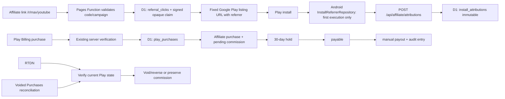

# Play-first Affiliate Architecture

Status: proposed; `AFFILIATE_ENABLED=false` by default. This design deliberately
uses the existing Cloudflare Pages Functions + D1 + Android Play flavour rather
than reintroducing Stripe, Firebase, a new database, or microservices.

## Design decisions

- Attribution model: **last valid affiliate click before first Play install**, with
  a 30-day click-to-install window and a 60-day install-to-purchase window.
- A valid click is server-created and points to an active affiliate/campaign.
  The client never declares an affiliate ID directly.
- The referrer carries only a short-lived opaque, signed click claim; not the
  affiliate's name, buyer data, or a raw D1 primary key.
- One install can receive at most one immutable attribution. A later click,
  reinstall, update, account change or Direct APK cannot overwrite it.
- Commission is based only on a server-verified, purchased, acknowledged
  Google Play `pro` purchase whose installed app has a valid attribution.
- Direct APK is outside the MVP: it has `attribution_source=none` and cannot
  create a Play-affiliate commission. A Direct-to-Play transition is eligible only
  when a fresh Play install supplies a valid Play referrer.



## Redirect and referrer protocol

`GET /r/:affiliateCode/:campaignSlug?` accepts no caller-controlled destination.
It normalizes the path, verifies an active affiliate and optional active campaign,
creates a random `click_id`, and inserts a pseudonymous D1 event. It responds 302
only to the configured package listing:

```text
https://play.google.com/store/apps/details?id=de.classydl.app&referrer=dt_v1%3D...
```

`dt_v1` is URL-encoded structured data containing `click_id`, expiry and a version,
then authenticated with an HMAC whose key remains in a Worker secret. Its total size
must remain under a conservative 512 bytes. The backend verifies the MAC and expiry;
it looks up affiliate/campaign from `click_id`, not from a supplied affiliate code.

Invalid/disabled codes must return a non-tracking information page or `404`; they
must not redirect, leak the partner's status, or accept a `next`/`url` parameter.

## Install Referrer integration

Add `implementation "com.android.installreferrer:installreferrer:2.2"` to the
Play flavour only. The official library documentation currently specifies 2.2 and
requires a one-time first-execution call; the value is available for 90 days and is
unchanged except on reinstall. See [Google's Install Referrer library guide](https://developer.android.com/google/play/installreferrer/library).

`InstallReferrerRepository` should:

1. Run once after the existing install identity exists and only in `play`.
2. Persist state `not_started|retryable|unavailable|submitted|final` locally.
3. On `OK`, read referrer plus Google-provided click/install timestamps, validate
   the *format* locally, POST once to the backend, then store `submitted` only
   after a definitive response.
4. Treat `FEATURE_NOT_SUPPORTED` as final `unavailable` without attribution.
5. Treat `SERVICE_UNAVAILABLE`/disconnect as retryable using bounded exponential
   retry (for example 3 attempts over 24 hours); never block the app UI.
6. Call `endConnection()` on every completion path. Do not read the referrer on
   every app start and do not log its raw value.

The attribution endpoint verifies MAC, expiry, click existence, package release
policy, and timestamp plausibility. It stores a hash of `InstallIdentity`, never the
raw ID, and uses `UNIQUE(install_id_hash)` to make the winning attribution immutable.

## Minimal D1 schema

| Table | Key constraints and purpose |
|---|---|
| `affiliates` | `id`, unique normalized `code`, status, commission policy/version; partner business data stays separate from buyer data. |
| `affiliate_campaigns` | `UNIQUE(affiliate_id, slug)`; active/disabled campaigns. |
| `referral_clicks` | `click_id` unique, affiliate/campaign FK, created/expires timestamps, minimal hash-only abuse metadata. |
| `install_attributions` | `UNIQUE(install_id_hash)`, `UNIQUE(click_id)`, immutable attribution, referrer/click/install timestamps and source/version. |
| `affiliate_purchases` | `UNIQUE(play_purchase_token_hash)` and `UNIQUE(order_id)` when present; FK to attribution and existing `play_purchases`. |
| `commissions` | `UNIQUE(affiliate_purchase_id)`, monetary cents, policy version, status and scheduled `available_at`. |
| `affiliate_event_inbox` | `UNIQUE(source, external_event_id)` for RTDN `messageId`, reconciliation page cursor and admin actions. |
| `affiliate_audit_events` | append-only actor/action/object/result/reason; no raw token/order value. |
| `affiliate_payouts` / `affiliate_payout_items` | manual payout proposal and allocation; no automatic bank transfer. |

Indexes: clicks by `(affiliate_id, created_at)`, commissions by `(status,
available_at)`, purchases by `order_id`, and reconciliation cursor by source. All
monetary values are integer minor units plus ISO currency; no floats.

## Lifecycle and state machine

```mermaid
stateDiagram-v2
  [*] --> pending: server-verified Play purchase + valid attribution
  pending --> payable: hold elapsed; no fraud/revocation; reconciliation clean
  pending --> voided: refund, void, chargeback, cancellation or fraud hold rejection
  pending --> fraud_hold: rule/analyst flag
  fraud_hold --> pending: cleared before hold expiry
  fraud_hold --> voided: rejected
  payable --> paid: admin records external payment reference
  payable --> voided: late void/refund; negative balance adjustment if already paid
  paid --> clawback_due: late void/refund
  clawback_due --> [*]: offset/manual recovery recorded
```



Every transition is a server-side compare-and-set transaction, writes an audit event
with an idempotency key, and is reproducible from the purchase and event history.
Use a 30-day safety period for the MVP: it is conservative for a one-time product,
simple to explain, and keeps the first payout run independent of fast RTDN timing.

## Google Play API requirements

| API/capability | Runtime need | Why |
|---|---|---|
| Play Install Referrer Library | Android Play flavour | Reads the install referrer; no Cloud API activation. |
| Google Play Developer API | Worker | `purchases.productsv2.getproductpurchasev2`, legacy supported product acknowledgement endpoint, `orders.refund` only for the existing refund feature, and `voidedpurchases.list`. |
| Cloud Pub/Sub | Runtime | Existing RTDN topic and authenticated push subscription. |
| Play Integrity API | Not MVP | Consider only after observed fraud; it is not proof of affiliate eligibility. |

The current official API reference lists `productsv2.getproductpurchasev2`,
`purchases.products.acknowledge`, `orders.refund`, and `voidedpurchases.list`.
RTDN messages must cause a fresh Developer API read, not themselves be treated as a
complete purchase record. Sources: [Play API reference](https://developers.google.com/android-publisher/api-ref/rest), [RTDN reference](https://developer.android.com/google/play/billing/rtdn-reference), [Voided Purchases API](https://developers.google.com/android-publisher/voided-purchases).
